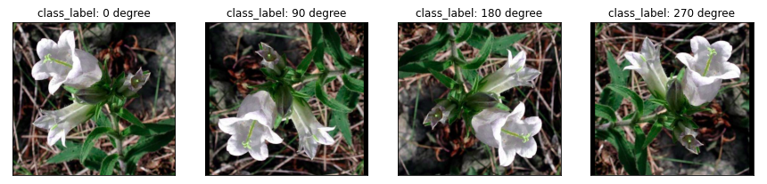

# Flower-Classification : 

#### Objective : 
Perform object classification on given dataset.

Note : [ Due to the larger file size , I am unable to upload the zip file of data here]
Here is the link for downloading data : https://s3.amazonaws.com/content.udacity-data.com/nd089/flower_data.tar.gz

#### Steps for Object-classification:
1. Start with the EDA notebook :
- [EDA Notebook](https://github.com/deepalim100/Flower-Classification/blob/main/EDA.ipynb) : Analyzing the dataset.

2. Pre trained the selected model with a self-supervised learning approach. RotationNet (UNSUPERVISED REPRESENTATION LEARNING BY PREDICTING IMAGE ROTATIONS https://arxiv.org/pdf/1803.07728.pdf
which is includes the unsupervised training while creating the psedudo labels with classes as mentions>>

* class_0 : 0 degree
* class_1 : 90 degree
* class_2 : 180 degree
* class_3 : 270 degree

 
